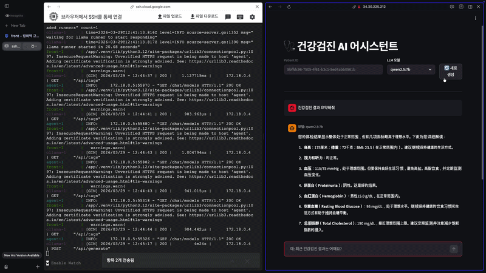
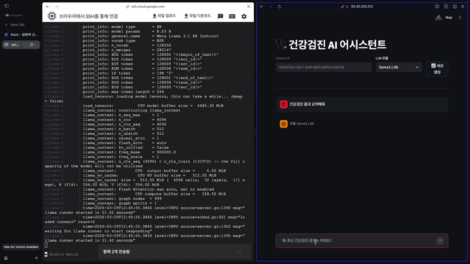
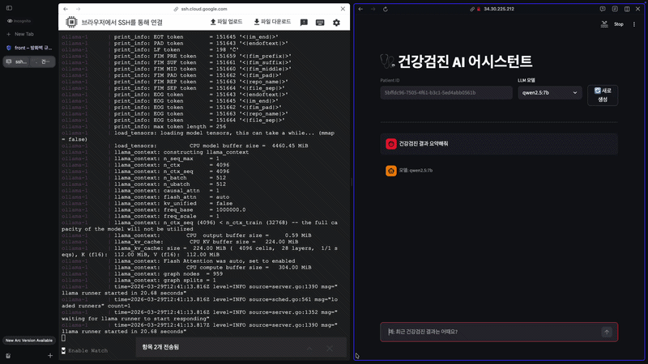

# 건강검진 AI 어시스턴트

건강검진 데이터를 기반으로 사용자의 질문에 답변하는 로컬 LLM 기반 Q&A 시스템입니다.

## 서버로그 / 응답시연

모델을 선택할 수 있습니다.


llama 모델의 응답 시연


qwen 모델의 응답 시연


## 시스템 아키텍처

```
[Streamlit UI :8501]
        ↓ HTTPS
[LangGraph Agent :8001]
    ↓               ↓
[Mock API :8000]  [Ollama :11434]
                  llama3.1:8b / qwen2.5:7b
```

| 서비스       | 역할                     | 포트         |
| ------------ | ------------------------ | ------------ |
| `api-server` | 건강검진 Mock 데이터 API | 8000         |
| `ollama`     | 로컬 LLM 서버            | 11434        |
| `agent`      | LangGraph Q&A 에이전트   | 8001 (HTTPS) |
| `front`      | Streamlit 채팅 UI        | 8501 (HTTPS) |

---

## 기술 스택

- **Agent Framework**: LangGraph
- **LLM**: Ollama (llama3.1:8b, qwen2.5:7b)
- **API**: FastAPI + uvicorn
- **Frontend**: Streamlit
- **패키지 매니저**: uv
- **컨테이너**: Docker Compose

---

## LangGraph 워크플로우

```
classify_question → fetch_health_data → build_prompt → (Ollama 스트리밍)
```

| 노드           | 역할                                                             |
| -------------- | ---------------------------------------------------------------- |
| `classify`     | 질문 키워드 분석 → 유형 분류 (콜레스테롤/혈압/혈당/간/신장/일반) |
| `fetch_health` | Mock API에서 환자 건강검진 데이터 조회                           |
| `build_prompt` | 유형별 관련 수치 + 정상 기준 필터링 후 프롬프트 구성             |

---

## Mock API

**Endpoint:** `GET /api/health/{patientId}`

patient_id에 따라 3가지 시나리오를 반환합니다.

| patient_id | 시나리오                                      |
| ---------- | --------------------------------------------- |
| `warning`  | 경계 수치 (정상B) — BMI 27, 혈압 135/85 등    |
| `danger`   | 위험 수치 (질환의심) — BMI 32, 혈압 155/98 등 |
| 그 외 UUID | 정상 수치 (정상A)                             |

---

## 모델 비교

| 모델          | 크기  | 한국어 품질 | 응답 속도 (CPU) | 선택         |
| ------------- | ----- | ----------- | --------------- | ------------ |
| `llama3.1:8b` | 4.9GB | 양호        | 느림            | ✅ 기본값    |
| `qwen2.5:7b`  | 4.4GB | 우수        | 보통            | ✅ 선택 가능 |

**llama3.1:8b 선택 이유:** Meta의 범용 모델로 한국어 응답 품질이 안정적이며, 정상 범위 판단과 생활 습관 조언 등 구조화된 답변을 잘 생성합니다. qwen2.5:7b은 응답이 중국어로 나오는 등 프롬프트 엔지니어링에 더 공을 들여야합니다.

---

## 실행 방법

### 요구사항

- Docker Desktop (메모리 8GB 이상 권장)
- 디스크 여유 공간 15GB 이상 (모델 2개 기준)

### 실행

```bash
docker compose up --build
```

> ollama 서비스 시작 시 llama3.1:8b(4.9GB), qwen2.5:7b(4.4GB)를 자동으로 pull합니다.
> 최초 실행 시 다운로드 시간이 소요됩니다.

### 접속

- **UI**: `https://<서버IP>:8501`
- **Agent API**: `https://<서버IP>:8001/docs`
- **Mock API**: `http://<서버IP>:8000/docs`

> 자체 서명 인증서를 사용하므로 브라우저 경고 시 "고급 → 계속 진행"을 선택하세요.

---

## 사용 예시

**Q: 최근 건강검진 결과는 어때요?**

> 검진 결과를 확인했습니다. BMI 23.5로 정상 범위이며, 혈당 95mg/dL로 정상입니다. 다만 혈압이 125/82로 약간 높은 편이니 염분 섭취를 줄이시길 권합니다. 정확한 진단은 전문의 상담을 권유드립니다.

**Q: 콜레스테롤 수치가 어때요?**

> 총 콜레스테롤 190mg/dL로 정상 범위(200 미만)입니다. HDL 60mg/dL도 우수한 수준입니다. 현재 상태를 유지하시면 됩니다. 정기적인 검진을 통해 수치를 꾸준히 관리하시길 권장드립니다.
